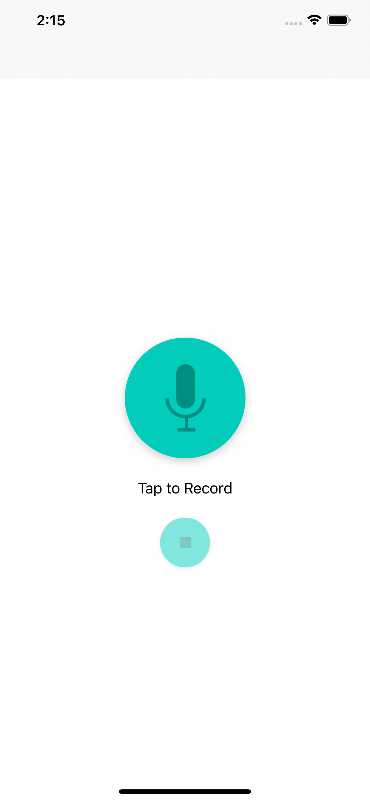
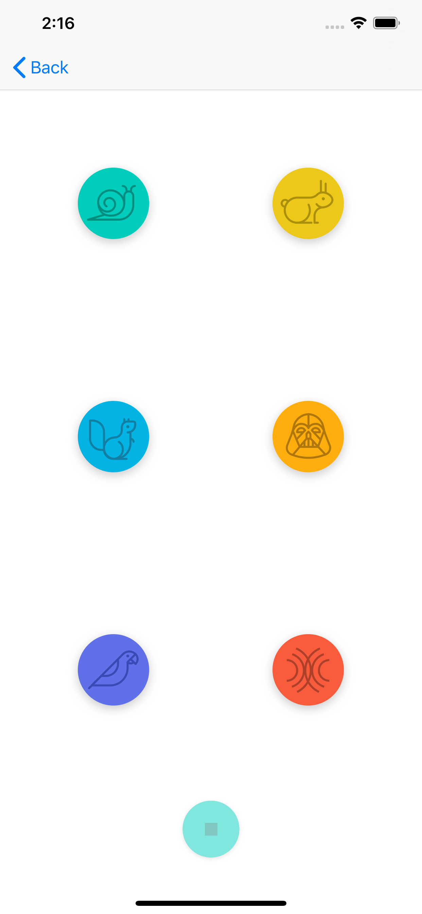

# Pitch Perfect
This app was developed as a project for Udacity's iOS Developer Nanodegree.

The app allows the user to create a sound recording and play it back with different sounds effects added: slow, fast, high pitch, low pitch, echo and reverb.

## Implementation
The app was implemented using Swift 5.1 and Xcode 11.4